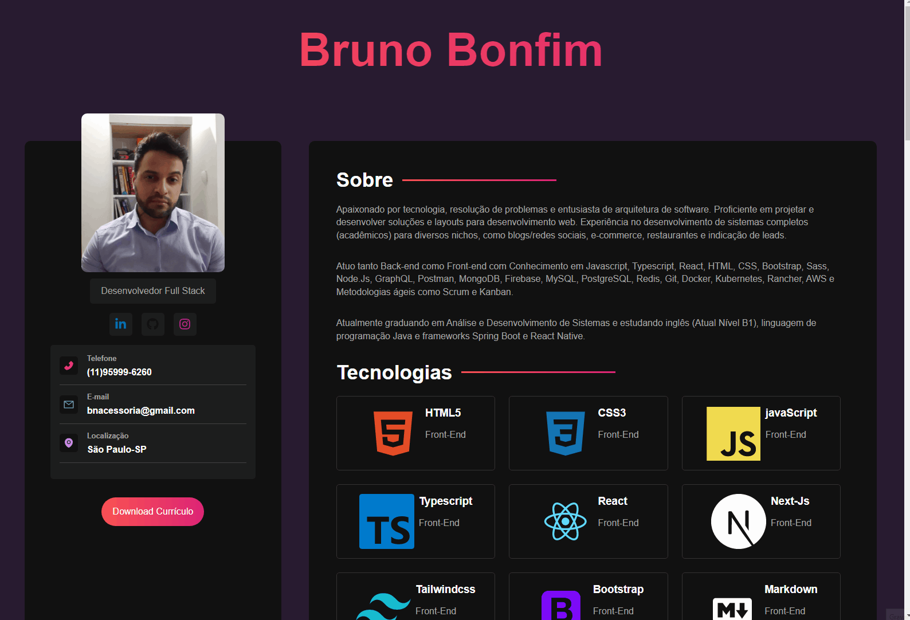

# Portifólio Profissional 📌

> Portifólio Pessoal para Dev-Network 📋💻👨‍💻
#

* #### Deploy Netlify ☁️
    * [Portifólio Bruno](https://portifolio-bruno-bn.netlify.app) 📑
#
#
### Skills

* > Stacks 📚 and Skills 🧠:
    * > Vite
        *  Vite 
            * usando [Vite](https://vitejs.dev/) ao invés de CRA (create-react-app)
                * ```
                    npm create vite@latest 
    * > React
        *  React-Js 
            * JSX
            * Props
            * ReactDom
            * React-Icons
    * > Sass
        *  Sass 
            * Organização e separação de componentes
            * Variaveis
            * Plugins
            * Layouts, Modulos e Mixins Sass
    * > Javascript
        *  JavaScript 
            * DOM
            * Eventos
            * Funções
    * > HTML
        *  HTML 
            * Favicon
#

<div align="center">
<h3>Projeto Portifólio 📋💻👨‍💻</h3>
<br/>

</div>


